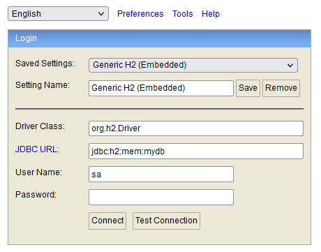

# Drones App

### Build and run application
* To build this application use maven (my version is 3.8.4) with the commands:
``` 
mvn clean package
```

* Then, create the docker image with the commands:
```
docker build -t droneapp .
```

* In order, create the docker container:
```
docker run -p 8086:8086 --name drone-app droneapp
```

* This application uses a h2 datasource on memory strategy, so, in order to enter the datasource is as follows: the password is 'password' for convenience.



### Using the application
* Create a drone


*  Loading a drone with medications


Inside the medications property in the json must be type map, key and value, the key is the medication id and the value is the quantity.

* List loaded medication items for a given drone


* Check current battery level for given drone


* Check available drones for loading


